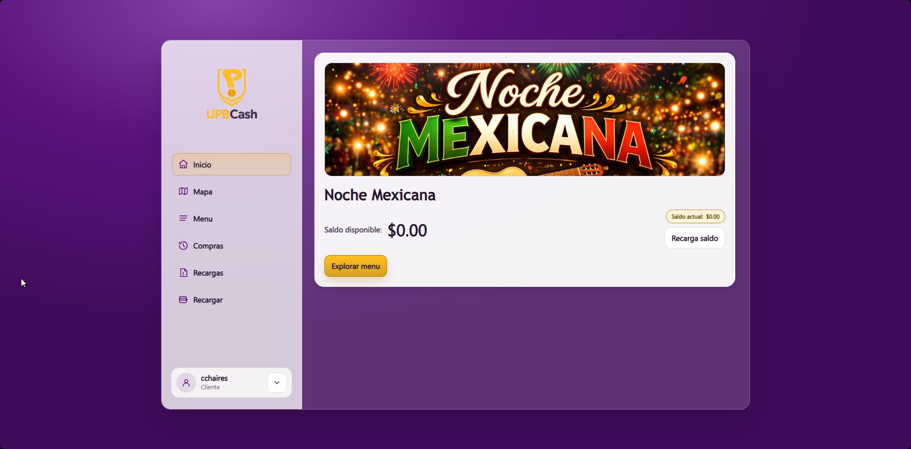
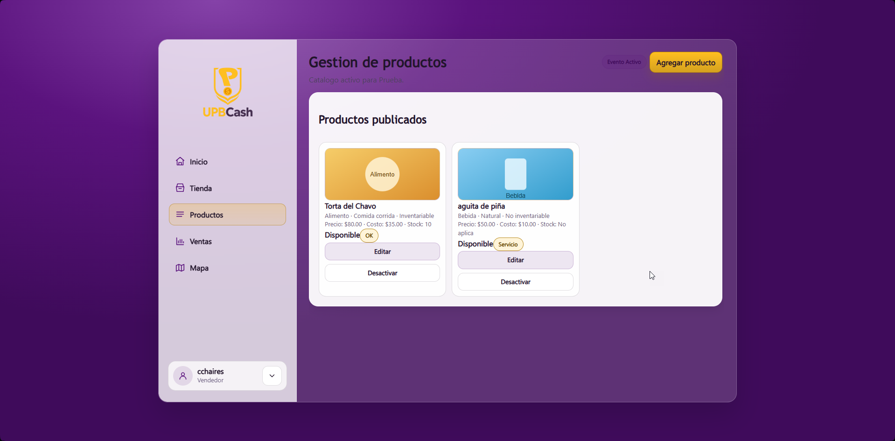
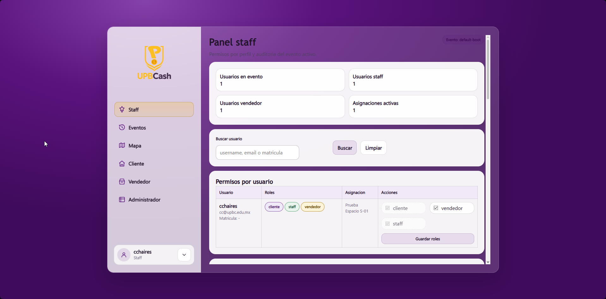
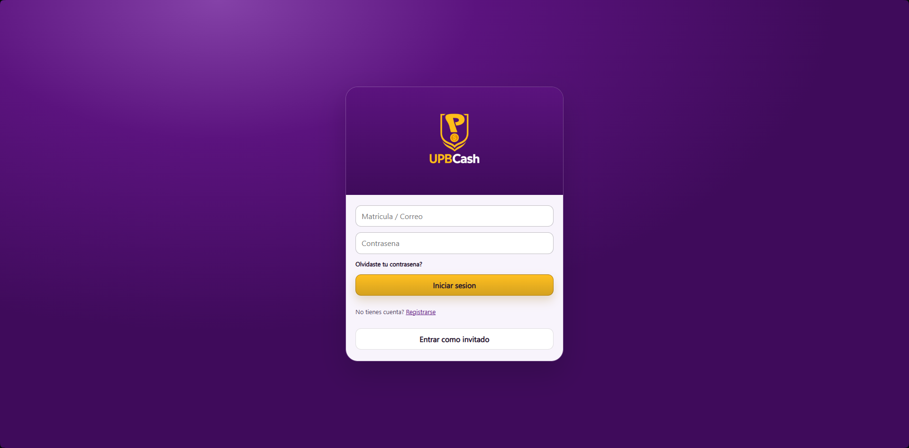
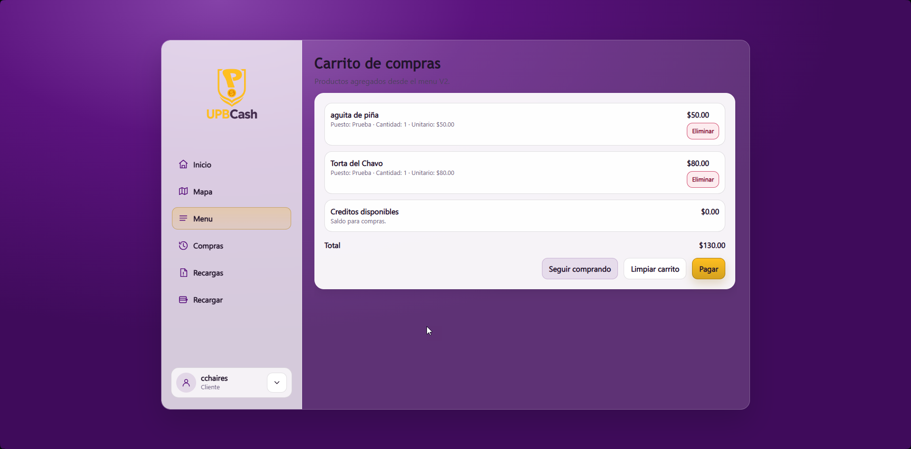
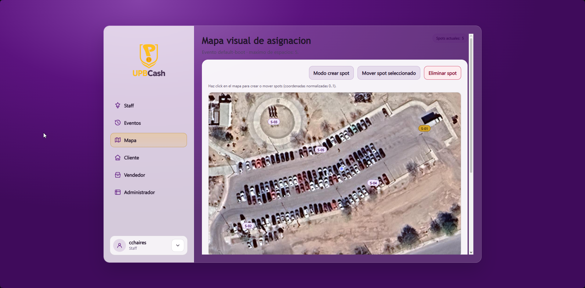

# UNIVERSIDAD POLITECNICA DE BAJA CALIFORNIA

## COORDINACION DE TECNOLOGIAS

### Reporte Final - Proyecto Integrador

**Nombre del proyecto:** UPBCash  
**Periodo del reporte:** enero-marzo de 2026  
**Campus:** Mexicali  
**Integrantes del equipo:**  
- Pedro Alejandro Aparicio Herrera
- Oliver Moreno Gallegos
- Alan Vega Millan
- Carlos Arturo Chaires Armenta

---

## 1.1 Resumen de actividades realizadas durante el periodo del proyecto (enero-marzo de 2026)

### Estado general del proyecto

**Estado general:** En tiempo

Durante el periodo de enero-marzo de 2026, el equipo consolido UPBCash como una aplicacion web basada en Django orientada a la administracion de eventos universitarios con moneda virtual, control de compras y gestion por roles. En esta etapa se paso de una conceptualizacion temprana del sistema a una implementacion funcional con modulos de cliente, vendedor y staff, asi como persistencia de datos, APIs internas, control de permisos y validaciones automatizadas. El resultado es una base de software coherente, desplegable en desarrollo local y preparada para evolucionar hacia etapas posteriores de estabilizacion, evidencia visual y afinacion operativa.

### Resumen de situacion

El proyecto se enfoco en resolver problemas reales detectados en kermeses y eventos escolares: pagos presenciales, uso de boletos fisicos, desorden logistico, falta de visibilidad del menu y poca trazabilidad de ventas. A partir de esa necesidad, se estructuro una solucion web multirol con una arquitectura modular en Django. Durante enero-marzo de 2026 se consolidaron el flujo de compra con UCoins, la gestion de puestos y productos, el panel operativo de staff, el mapa de espacios y el sistema de pruebas. Al cierre del periodo, la aplicacion cuenta con rutas web, APIs internas, pruebas funcionales automatizadas y soporte para SQLite local con opcion de PostgreSQL en entornos de mayor demanda.

### Hitos alcanzados

1. Definicion y consolidacion del alcance funcional del sistema a partir de la necesidad detectada en eventos universitarios.
2. Implementacion del esquema Django modular con apps `events`, `stalls`, `commerce`, `accounting`, `operations` y `core`.
3. Habilitacion de flujos separados por rol: cliente, vendedor y staff, con adaptacion dinamica de la interfaz segun permisos.
4. Implementacion del flujo de compra con carrito, checkout, generacion de orden y validacion de entrega mediante QR.
5. Implementacion de gestion de productos por vendedor, incluyendo control de stock, costeo, precios e imagenes.
6. Implementacion del panel staff para asignar roles, administrar eventos, asignar vendedores, otorgar UCoins y gestionar espacios en mapa.
7. Integracion de soporte de persistencia con SQLite y compatibilidad para PostgreSQL mediante variables de entorno.
8. Validacion tecnica del sistema con `manage.py check` sin incidencias y ejecucion satisfactoria de `42` pruebas automatizadas.

### Riesgos criticos y observaciones

- No se encontro en la documentacion una asignacion formal de responsables individuales para `RGPY`, `RAPE` y `RDS`; por ello se dejan como dato pendiente de completar.
- El formato institucional hace referencia a graficos, cronograma Gantt y capturas; en la carpeta de documentacion no se identifico un Gantt final consolidado, por lo que en este borrador se sustituye por una tabla comparativa de avance.
- La aplicacion esta tecnicamente funcional en entorno local, pero aun depende de la integracion de evidencia visual final para fortalecer la entrega academica.
- El proyecto se encuentra estable desde la perspectiva de software base, aunque el despliegue productivo avanzado no forma parte del alcance actual.

### Avance de actividades

| Bloque | Actividades completadas | Actividades en proceso |
|---|---|---|
| Analisis y planteamiento | Definicion del problema, usuarios, roles y valor de la plataforma | Ajuste fino de criterios de uso y priorizacion para presentacion final |
| Diseno | Definicion de modulos, arquitectura base, pantallas principales y navegacion por rol | Integracion de evidencia grafica final en el reporte |
| Desarrollo backend | Modelos, rutas, APIs, servicios, persistencia, permisos y validaciones de negocio | Mejoras incrementales y endurecimiento de reglas operativas |
| Desarrollo frontend | Layouts compartidos, sistema visual, paneles de cliente, vendedor y staff | Captura y curacion de pantallas para anexos |
| Pruebas | Validacion con pruebas automatizadas y revision de integridad del proyecto | Ampliacion opcional de pruebas para entregas posteriores |
| Documentacion | Plan de desarrollo, resumen ejecutivo, workshop, teoria del proyecto y reporte final en borrador | Ajuste de formato academico final y conversion a Word/PDF si se requiere |

### Evidencia tecnica sugerida

- Captura de pantalla de inicio de sesion: `inicio_sesion.png`
- Captura del panel principal de cliente: `panel_principal_cliente.png`
- Captura del menu o carrito del cliente: `carrito_cliente.png`
- Captura del panel de vendedor con productos: `panel_vendedor_productos.png`
- Captura del panel staff: `panel_staff.png`
- Captura del mapa o modulo de asignacion de espacios: `mapa_asignacion.png`
- Tabla de validacion tecnica integrada en la seccion de Pruebas

### Tablas, graficos o diagramas recomendados

- Tabla de modulos funcionales y responsabilidades.
- Tabla de rutas web y APIs clave.
- Tabla de pruebas ejecutadas y resultados.
- [Insertar diagrama o captura de arquitectura modular del proyecto]
- Comparativo visual de interfaces por rol integrado en la seccion de Diseno

### Cronograma de actividades (estado de tiempos)

Debido a que no se localizo un diagrama Gantt final consolidado dentro de la documentacion disponible, el estado del cronograma se presenta mediante una tabla de avance por bloque, tomando como referencia el trabajo efectivamente visible en documentacion, codigo fuente y pruebas automatizadas.

| Bloque | Estado | Evidencia del avance |
|---|---|---|
| Diseno | Completado | Documentos de teoria, workshop, user persona y enfoque de interfaz |
| Desarrollo | Completado en su base funcional | Proyecto Django con modulos implementados, servicios, modelos y rutas activas |
| Pruebas | Completado en el alcance revisado | `manage.py check` sin issues y `42` pruebas en verde |
| Documentacion | En proceso avanzado | Existe documentacion previa y este reporte final consolida el periodo enero-marzo de 2026 |

### Gestion de recursos y costos

#### Materiales y software utilizados

- Python 3.10/3.11 para desarrollo.
- Django como framework principal del sistema.
- SQLite como base de datos local por defecto.
- PostgreSQL como base de datos soportada para entornos de desarrollo con mayor robustez.
- Docker y Docker Compose para levantar servicios de apoyo en desarrollo.
- Visual Studio Code como entorno de trabajo sugerido en la documentacion.
- Git para control de versiones.

#### Herramientas y facilidades empleadas

- Equipo de computo personal.
- Entorno virtual de Python para aislar dependencias del proyecto.
- Carpeta de documentacion institucional y tecnica del proyecto.
- Pruebas automatizadas sobre entorno local.

#### Observacion de costos

No se identifico en la documentacion una bitacora monetaria formal de costos del proyecto. En consecuencia, para este reporte se deja constancia de que los recursos utilizados fueron principalmente software de desarrollo, tiempo de trabajo del equipo y herramientas de programacion, sin cuantificacion economica documentada dentro del repositorio actual.

### Problemas, riesgos y soluciones

| Problema o riesgo | Impacto | Solucion implementada o propuesta |
|---|---|---|
| Desorden en pagos y uso de boletos fisicos en eventos | Alto | Se planteo y desarrollo un sistema con UCoins, historial de movimientos y compra digital |
| Falta de visibilidad de productos y ubicacion de puestos | Alto | Se implementaron menu por puesto y mapa de espacios con asignaciones visuales |
| Ambiguedad operativa por multiples roles | Medio | Se separaron vistas, permisos y paneles para cliente, vendedor y staff |
| Riesgo de inconsistencias de saldo o compras duplicadas | Alto | Se incorporo logica de servicios para checkout, ledger y validaciones de idempotencia |
| Riesgo de errores por cambios funcionales | Medio | Se agrego una base de pruebas automatizadas para flujos clave |
| Falta de cronograma formal consolidado en documentacion final | Bajo | Se sustituyo temporalmente por tabla comparativa de avance y evidencia funcional |

---

## 2.1 Proposito

El proposito de este documento es presentar el Reporte Final del proyecto UPBCash correspondiente al periodo enero-marzo de 2026, integrando el trabajo realizado en el diseno, desarrollo y validacion de un sistema de informacion automatizado para la gestion operativa de eventos universitarios. El sistema fue concebido para atender problemas recurrentes en kermeses y actividades escolares, especialmente aquellos relacionados con pagos presenciales, uso de boletos fisicos, falta de control sobre ventas, poca visibilidad de los productos disponibles y escasa trazabilidad administrativa.

UPBCash propone una plataforma web que centraliza la operacion del evento mediante creditos virtuales denominados UCoins, gestion de roles diferenciados, administracion de puestos, control de productos, historial de compras y herramientas operativas para staff. En este periodo, el proyecto evoluciono desde su planteamiento conceptual y documental hacia una base funcional implementada con Django, organizada por modulos y validada tecnicamente con pruebas automatizadas. Por ello, este reporte tiene la finalidad de documentar el estado real del proyecto, los avances logrados y la evidencia tecnica que respalda su desarrollo durante enero-marzo de 2026.

## 2.2 Ambito de responsabilidad

Las responsabilidades consideradas en el proyecto siguen la estructura indicada en el modelo institucional para el desarrollo de sistemas de informacion automatizados. Para efectos de este reporte final, se asignan responsables operativos por rol con base en la organizacion interna del equipo.

| Clave | Rol | Responsabilidad | Responsable asignado |
|---|---|---|---|
| RGPY | Responsable de Gestion de Proyectos | Supervision general del proyecto, seguimiento del cumplimiento de objetivos, coordinacion del trabajo del equipo y vigilancia del avance del producto | Pedro Alejandro Aparicio Herrera y Alan Vega Millan |
| RAPE | Responsable de la Administracion de Proyectos | Organizacion de actividades, seguimiento del cronograma, apoyo en documentacion y control de recursos del proyecto | Oliver Moreno Gallegos |
| RDS | Responsable del Desarrollo de Sistemas de Informacion | Diseno tecnico, programacion, integracion de modulos, pruebas y mantenimiento evolutivo del sistema | Carlos Arturo Chaires Armenta |

## 2.3 Definiciones

Los terminos utilizados en este reporte toman como referencia el **Modelo del Proceso para la Administracion del Desarrollo de Sistemas de Informacion Automatizados**, complementados con conceptos tecnicos propios de UPBCash y del proyecto Django implementado.

| Termino | Definicion |
|---|---|
| Sistema de informacion automatizado | Solucion de software que organiza, procesa y resguarda informacion de manera estructurada para apoyar operaciones y toma de decisiones |
| UPBCash | Plataforma web desarrollada para administrar pagos, compras, productos, puestos y operaciones de staff en eventos universitarios |
| UCoin | Moneda virtual interna utilizada por el sistema para representar saldo disponible y compras dentro del evento |
| Cliente | Usuario final que consulta productos, recarga saldo, compra y revisa su historial |
| Vendedor | Usuario responsable de administrar una tienda o puesto, sus productos y sus ventas dentro del evento |
| Staff | Usuario con permisos operativos para administrar roles, eventos, espacios, asignaciones y apoyo administrativo |
| Evento o campana | Contexto operativo principal donde se agrupan usuarios, puestos, productos, reglas y ventanas de operacion |
| Puesto o tienda | Unidad de venta registrada dentro del evento y asociada a vendedores y productos |
| Carrito | Estructura temporal donde el cliente agrupa productos previos al checkout |
| Checkout | Proceso mediante el cual el sistema valida stock, descuenta saldo, genera una orden y emite un token QR |
| Ledger | Registro contable de movimientos que da trazabilidad al saldo de los usuarios |
| QR de entrega | Token que permite validar la entrega de una orden pagada |
| API | Conjunto de rutas internas utilizadas para operaciones de checkout, validacion de QR, asignaciones y administracion del mapa |

## 2.4 Metodo de trabajo

El trabajo del proyecto durante enero-marzo de 2026 se organizo en tres ejes principales: **Diseno**, **Desarrollo** y **Pruebas**. Esta organizacion permitio mantener continuidad entre la documentacion inicial, la implementacion tecnica del sistema y la validacion del comportamiento esperado.

### 1. Diseno del software

La fase de diseno retomo el problema detectado en los eventos universitarios, donde la logistica de pagos, la distribucion de productos y el control administrativo se realizaban de forma poco eficiente. A partir de esa necesidad se estructuro una propuesta centrada en tres roles principales: cliente, vendedor y staff. Esta definicion permitio segmentar responsabilidades, vistas y permisos desde el inicio del proyecto.

En el plano funcional, se definieron las capacidades principales del sistema: registro y acceso de usuarios, consulta de menu, compra mediante saldo virtual, administracion de tiendas y productos, visualizacion de mapa, seguimiento de historial y control operativo por parte de staff. En el plano tecnico, se adopto una arquitectura modular basada en Django, separando responsabilidades mediante apps especializadas:

- `events`: campanas, membresias, grupos y contexto del evento.
- `stalls`: mapa, espacios, tiendas, categorias y productos.
- `commerce`: carrito, ordenes, QR y entrega.
- `accounting`: ledger, recargas, saldos y movimientos.
- `operations`: acciones de staff, soporte y bitacora.
- `core`: vistas, layouts y experiencia de usuario.

Tambien se diseno una interfaz adaptable al rol activo del usuario. La documentacion complementaria del proyecto establece que el administrador y el proveedor pueden acceder a las funciones de cliente, pero con opciones adicionales segun sus permisos, y que cada rol cuenta con una pantalla principal enfocada en sus tareas. Esa idea se materializo mediante layouts compartidos, navegacion por rol y controles de visibilidad condicionales.

### Evidencia visual de navegacion adaptada por rol







### 2. Desarrollo de software

La etapa de desarrollo consistio en traducir el planteamiento conceptual a una base funcional en Django, con persistencia de datos, reglas de negocio y soporte para evolucionar. El proyecto ya no corresponde a una solucion en consola como la descrita en etapas tempranas; durante enero-marzo de 2026 se consolido como una aplicacion web estructurada y extensible.

Entre los desarrollos mas relevantes se encuentran:

- Gestion de eventos con ventanas operativas y publicas.
- Menu dinamico por puesto para cliente.
- Carrito y checkout con validacion de saldo y stock.
- Generacion de orden y token QR para entrega.
- Panel de vendedor con productos, costeo, stock e imagenes.
- Panel staff con asignacion de roles, vendedores, UCoins y espacios en mapa.
- Registro contable del saldo mediante ledger.
- Auditoria de acciones de staff.
- Soporte de imagenes, archivos estaticos y layouts reutilizables.
- Configuracion por entorno para SQLite o PostgreSQL, con soporte Docker.

Como ejemplo de la estructura tecnica del sistema, las rutas principales se organizan desde el archivo central de URLs:

```python
urlpatterns = [
    path("admin/", admin.site.urls),
    path("", include("core.urls")),
    path("api/", include("commerce.api_urls")),
    path("api/", include("operations.api_urls")),
]
```

Asimismo, parte de la logica de negocio centralizada en servicios permite que operaciones criticas, como el checkout, se ejecuten dentro de transacciones y con validaciones consistentes:

```python
@transaction.atomic
def checkout_cart(cls, *, event, user):
    cart_items = list(
        CartItem.objects.select_for_update()
        .select_related("stall_product", "stall_product__stall")
        .filter(event=event, user=user)
        .order_by("id")
    )
    if not cart_items:
        raise ValueError("No hay productos en el carrito.")
```

El entorno tecnico del proyecto se resume en los siguientes componentes:

| Elemento | Implementacion actual |
|---|---|
| Framework principal | Django |
| Base de datos local | SQLite |
| Base de datos soportada | PostgreSQL |
| Contenedorizacion | Docker y Docker Compose |
| Configuracion | Variables de entorno desde `.env` |
| Archivos multimedia | `MEDIA_URL` y `MEDIA_ROOT` |
| Archivos estaticos | `static/` con sistema visual unificado |

#### Rutas web clave

- `/cliente/`
- `/cliente/menu/`
- `/cliente/carrito/`
- `/cliente/mapa/`
- `/vendedor/`
- `/vendedor/tienda/`
- `/vendedor/productos/`
- `/vendedor/ventas/`
- `/staff/`
- `/staff/eventos/`
- `/staff/mapa-asignacion/`

#### APIs clave

- `POST /api/events/{event_id}/cart/checkout`
- `POST /api/orders/{order_id}/qr/verify`
- `POST /api/events/{event_id}/staff/assign-vendor`
- `POST /api/events/{event_id}/staff/assign-spot`
- `POST /api/events/{event_id}/staff/grant-ucoins`
- `GET /api/events/{event_id}/map/state`

### Evidencia visual de flujos implementados

#### Inicio de sesion



#### Panel principal de cliente


#### Carrito del cliente



#### Panel de vendedor con productos


#### Panel staff


#### Mapa y asignacion de espacios



### 3. Pruebas

La validacion del software se apoyo en pruebas tecnicas sobre el proyecto Django real. Durante la revision del estado del sistema se ejecuto la verificacion estructural del proyecto mediante `manage.py check`, obteniendo como resultado **sin issues identificados**. Posteriormente se ejecuto la suite relevante de pruebas automatizadas del sistema, con un total de **42 pruebas**, todas concluidas en estado **OK**.

Estas pruebas cubren escenarios funcionales y de control relevantes para la operacion del sistema, entre ellos:

- acceso correcto a paneles segun rol;
- redireccion y bloqueo para usuarios sin permisos;
- bloqueo de cliente y vendedor cuando no existe evento activo;
- creacion, edicion y baja logica de productos por parte del vendedor;
- actualizacion de tienda e imagenes;
- integracion del menu con carrito del cliente;
- validacion del mapa y espacios asignados;
- operaciones de staff para sincronizar roles, asignar vendedores y otorgar UCoins;
- checkout con descuento de saldo y descuento de inventario;
- validacion de QR y entrega de pedido;
- consistencia del sistema visual compartido entre pantallas.

#### Evidencia de validacion tecnica

| Validacion | Resultado |
|---|---|
| `manage.py check` | System check identified no issues |
| Suite automatizada revisada | 42 pruebas ejecutadas |
| Estado final de la suite | OK |

#### Resumen interpretativo de pruebas

Las pruebas muestran que la base funcional del sistema es consistente en su estado actual: los permisos por rol operan correctamente, los flujos de compra y entrega tienen validaciones activas, y la arquitectura modular permite mantener separadas las responsabilidades del sistema. Este resultado no significa que el proyecto este completamente cerrado a futuras mejoras, pero si demuestra que la implementacion existente cuenta con un nivel suficiente de coherencia para respaldar la entrega academica del periodo enero-marzo de 2026.

#### Tabla de evidencia de `manage.py check`

| Comando ejecutado | Resultado esperado | Resultado obtenido |
|---|---|---|
| `python manage.py check` | Verificar integridad general de configuracion, apps, modelos y rutas | `System check identified no issues (0 silenced).` |

#### Tabla de evidencia de la suite automatizada

| Dato observado | Resultado |
|---|---|
| Total de pruebas ejecutadas | 42 |
| Duracion aproximada | 145.720 segundos |
| Base de datos de pruebas | Creada y destruida correctamente para el alias `default` |
| Estado final | `OK` |

#### Salida resumida de validacion

```text
Found 42 test(s).
System check identified no issues (0 silenced).
Ran 42 tests in 145.720s
OK
```

## 2.5 Anexos

### 2.5.1 Situaciones de riesgo en la programacion del proyecto

| No. | Riesgo | Tipo | Impacto | Consecuencia(s) | Acciones |
|---|---|---|---|---|---|
| 1 | Fallas en la base de datos | Tecnico | Alto | Perdida o corrupcion de informacion | Mantener respaldos, usar migraciones controladas y soporte PostgreSQL/SQLite |
| 2 | Errores en reglas de negocio | Software | Medio-Alto | Compras incorrectas, saldos inconsistentes o permisos mal asignados | Continuar con pruebas automatizadas y revision de servicios centrales |
| 3 | Uso incorrecto por parte de usuarios | Humano | Medio | Datos incompletos o acciones operativas equivocadas | Capacitar usuarios y simplificar la interfaz por rol |
| 4 | Falta de evidencia visual final para entrega academica | Documental | Medio | Entrega incompleta frente a la rubrica | Integrar capturas y anexos visuales antes de la version final |
| 5 | Ausencia de asignacion formal de responsables institucionales | Administrativo | Bajo | Inconsistencias en el formato del reporte | Completar nombres de `RGPY`, `RAPE` y `RDS` antes de la entrega final |
| 6 | Dependencia de configuracion local para despliegue | Infraestructura | Medio | Variaciones en comportamiento entre entornos | Mantener `.env`, Docker Compose y verificacion previa del entorno |

### 2.5.2 Anexos sugeridos para la entrega final

- Captura de pantalla de inicio de sesion: `inicio_sesion.png`
- Captura del panel cliente: `panel_principal_cliente.png`
- Captura del menu y carrito: `carrito_cliente.png`
- Captura del panel vendedor: `panel_vendedor_productos.png`
- Captura del panel staff: `panel_staff.png`
- Captura del mapa de asignacion: `mapa_asignacion.png`
- Tabla o evidencia de pruebas integrada en la seccion de Pruebas
- [Insertar diagrama o esquema de arquitectura modular]

---

## Resumen ejecutivo del proyecto

**Estado general del proyecto:** En tiempo  
**Periodo de reporte:** enero-marzo de 2026

### Resumen de situacion

Durante enero-marzo de 2026, el equipo enfoco su trabajo en consolidar UPBCash como una plataforma web funcional para la gestion digital de eventos universitarios. Se avanzo desde una fase documental y conceptual hacia una implementacion real con Django, organizada por modulos especializados y orientada a cubrir operaciones de cliente, vendedor y staff. En este periodo se habilitaron flujos de compra con saldo virtual, carrito, ordenes, validacion por QR, gestion de tiendas y productos, asignacion de espacios en mapa y controles administrativos para staff.

### Hitos alcanzados en la entrega del proyecto

1. Estructuracion del proyecto Django con separacion modular por dominios funcionales.
2. Implementacion de flujos operativos para cliente, vendedor y staff.
3. Integracion de servicios de saldo, checkout, QR y auditoria.
4. Configuracion de persistencia con SQLite y soporte para PostgreSQL.
5. Integracion de layouts compartidos y sistema visual consistente por rol.
6. Validacion tecnica mediante revision del proyecto y ejecucion de 42 pruebas automatizadas exitosas.

### Riesgos criticos y observaciones

El principal pendiente para una entrega academica completamente cerrada no es tecnico, sino documental: integrar capturas, diagramas y completar la asignacion de responsables institucionales si el formato oficial lo exige. En el plano de software, no se detectaron bloqueos criticos durante la revision del proyecto. La base implementada es consistente y funcional dentro del alcance validado.

### Evidencia tecnica

Como evidencia tecnica del estado actual del sistema, se verifico que el proyecto pasa `manage.py check` sin incidencias y que la suite relevante ejecuta `42` pruebas con resultado final `OK`. Ademas, el codigo fuente refleja una arquitectura modular basada en Django, con configuracion por entorno, soporte de APIs internas, control de roles y logica de negocio centralizada en servicios.

| Evidencia tecnica final | Resultado |
|---|---|
| Integridad del proyecto Django | `manage.py check` sin incidencias |
| Pruebas automatizadas | 42 pruebas ejecutadas |
| Estado de pruebas | `OK` |
| Arquitectura de software | Modular por apps: `core`, `events`, `stalls`, `commerce`, `accounting`, `operations` |
| Persistencia | SQLite local con soporte para PostgreSQL |
| Operacion local | Proyecto funcional en entorno local con `runserver` |
