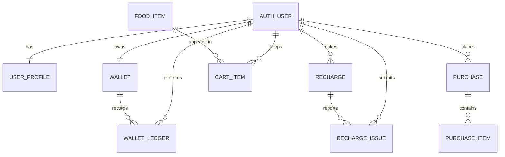

# UPBCash Django

Aplicacion web de UPBCash migrada desde prototipos HTML+CSS a Django con persistencia real de usuarios, saldo, recargas, carrito y compras.

## Estado del proyecto

- Migracion funcional de pantallas principales de cliente, vendedor y administrador.
- Autenticacion real (`login`, `registro`, `registro invitado`, `logout`).
- Persistencia de recargas e historial de recargas con reporte de incidencias.
- Persistencia de carrito, pago de compras e historial de compras.
- Trazabilidad de movimientos de saldo por ledger (`WalletLedger`).
- Configuracion de base de datos para SQLite (default) y PostgreSQL por variables de entorno.

## Stack

- Python 3
- Django 5
- PostgreSQL 16 (opcional para desarrollo/productivo)
- SQLite (fallback local)

## Estructura principal

- `core/models.py`: modelos de negocio.
- `core/views.py`: logica de autenticacion, wallet, recargas, carrito y compras.
- `core/templates/core/`: templates migrados.
- `static/core/`: css/js/img compartidos.
- `upbcash/settings.py`: configuracion por entorno.
- `docker-compose.yml`: servicio local de PostgreSQL.
- `.env.example`: variables de entorno de referencia.
- `MIGRACION_GAPS.md`: checklist de migracion (actualizado a completado en bloques trabajados).

## Modelo de datos (resumen)

- `User` (Django auth)
- `UserProfile` (1:1 con `User`)
- `Wallet` (1:1 con `User`, saldo actual)
- `WalletLedger` (N:1 con `Wallet` y `User`)
- `Recharge` (N:1 con `User`)
- `RechargeIssue` (N:1 con `Recharge` y `User`)
- `FoodItem` (catalogo)
- `CartItem` (N:1 con `User` y `FoodItem`)
- `Purchase` (N:1 con `User`)
- `PurchaseItem` (N:1 con `Purchase`, snapshot de item comprado)

## Diagrama ER (Mermaid)



## Configuracion de entorno

Crear archivo `.env` basado en `.env.example`.

Variables clave:

- `DJANGO_SECRET_KEY`
- `DJANGO_DEBUG`
- `DJANGO_ALLOWED_HOSTS`
- `DB_ENGINE` (`sqlite` o `postgresql`)
- `DB_NAME`, `DB_USER`, `DB_PASSWORD`, `DB_HOST`, `DB_PORT`, `DB_CONN_MAX_AGE`
- `POSTGRES_PORT` (para docker compose)

## Ejecucion local (SQLite)

```bash
cd "Proyecto UPBCASH/upbcash_django"
./venv/bin/pip install -r requirements.txt
./venv/bin/python manage.py migrate
./venv/bin/python manage.py runserver
```

## Ejecucion local (PostgreSQL con Docker)

```bash
cd "Proyecto UPBCASH/upbcash_django"
cp .env.example .env
# Ajustar password/host si aplica

docker compose up -d db
./venv/bin/pip install -r requirements.txt
./venv/bin/python manage.py migrate
./venv/bin/python manage.py runserver
```

## Notas de integridad

- Las operaciones de recarga y pago usan transacciones (`transaction.atomic`).
- Para evitar condiciones de carrera en saldo, se bloquea la wallet con `select_for_update` durante recarga/pago.
- Cada movimiento monetario exitoso crea registro en `WalletLedger`.

## Comandos utiles

```bash
./venv/bin/python manage.py check
./venv/bin/python manage.py makemigrations
./venv/bin/python manage.py migrate
./venv/bin/python manage.py createsuperuser
```
